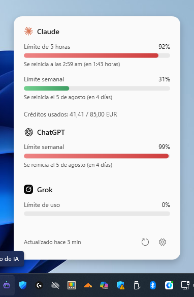

  

<h1 align="center">Uso de IA</h1>

  Una app de bandeja del sistema para Windows que te muestra, de un vistazo, 
  cuánto llevas consumido de tus límites de Claude, ChatGPT y Grok.

## Qué hace

  

Vive en la bandeja del sistema (junto al reloj) y, al pasar el ratón por encima, muestra un panel con el % de uso de cada servicio que tengas activado, cuándo se reinicia cada límite, y (si aplica) el gasto en créditos.

- **Claude** — límite de 5 horas y límite semanal, más créditos de pago extra si los usas.
- **ChatGPT** — límite semanal.
- **Grok** — límite de uso.

No usa ninguna API de pago: lee los datos directamente de tu sesión ya iniciada en cada web, con una ventana de navegador (WebView2) aislada por servicio.

## Instalación

1. Ve a la sección [Releases](../../releases) y descarga el `.exe` de la última versión.
2. Ejecútalo. No hace falta instalar nada más — es autocontenido (no necesitas tener .NET instalado).
3. Haz clic derecho en el icono de la bandeja → **Iniciar sesión** → elige el servicio, e inicia sesión normalmente en la ventana que se abre.

La app se actualiza sola: al arrancar comprueba si hay una versión más nueva en este repositorio y, si aceptas, se descarga y se reinstala ella misma — sin que tengas que volver a descargar nada a mano ni volver a iniciar sesión en ningún servicio.

## Ajustes

Clic derecho en el icono de la bandeja → **Ajustes**, o doble clic en el icono. Desde ahí puedes:

- Elegir qué servicios se muestran y con qué frecuencia se actualizan.
- Modo del panel emergente (ventana flotante o tooltip sencillo) y retraso al pasar el ratón.
- Tema claro/oscuro/sistema y color de acento.
- Notificaciones (aviso + sonido) cuando un límite se reinicia.
- Un bot de Telegram opcional: escríbele `/uso` en cualquier momento para consultar tu consumo actual sin abrir el PC.

## Notas

- Cada servicio usa un perfil de WebView2 aislado (`%LocalAppData%\ClaudeUsageTray\WebView2_<Servicio>`) — no comparte cookies con tu navegador normal, así que necesitas iniciar sesión una vez dentro de la propia app.
- Gemini no está soportado: Google exige una cabecera de validación (`X-Browser-Validation`) que solo el binario nativo de Chrome puede calcular, así que su endpoint de uso es inalcanzable desde una WebView2 embebida — no es un límite técnico nuestro, es una barrera puesta a propósito por Google.
